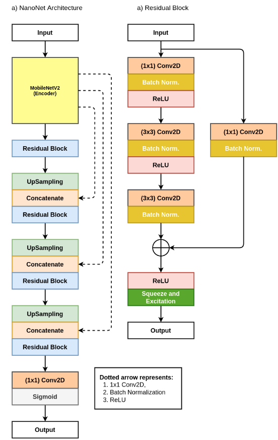

# NanoNet: Real-Time Polyp Segmentation in Endoscopy

The architecture of the NanoNet follows an encoder-decoder approach as shown in Figure 1. As depicted in  Figure  below, the network architecture uses a  pre-trained model as an encoder, followed by the three decoder blocks. Using pre-trained Ima-geNet  models for transfer learning has become the best choice for many CNN architecture. It helps the model converge much faster and achieve high-performance compared to the non-pre-trained model. The proposed architecture uses a MobileNetV2 model pre-trained on the ImageNet dataset as the encoder.  The decoder is built using a  modified version of the residual block, which was initially introduced by He et al. The encoder is used to capture the required contextual information from the input,  whereas the decoder is used to generate the final output by using the contextual information extracted by the encoder.

[NanoNet: Real-Time Polyp Segmentation in Endoscopy](nanonet.pdf).

## Architecture

## Requirements:
	os
	numpy
	cv2
	tensorflow
	glob
	tqdm

## Proposed architecture

## Results

## Citation
Please cite our paper if you find the work useful: 
<pre>
@proceedings{jha2021nanonet,
  title={NanoNet: Real-Time Polyp Segmentation in Endoscopy},
  author={Jha, Debesh and Ali, Sharib and Tomar, Nikhil Kumar and Johansen, H{\aa}vard D and Johansen, Dag and Rittscher, Jens and Riegler, Michael A and Halvorsen, P{\aa}l},
  booktitle={IEEE Computer Based Multimedia System},
  publisher={IEEE}
}
</pre>

## Contact
Please contact debesh@simula.no for any further questions.
